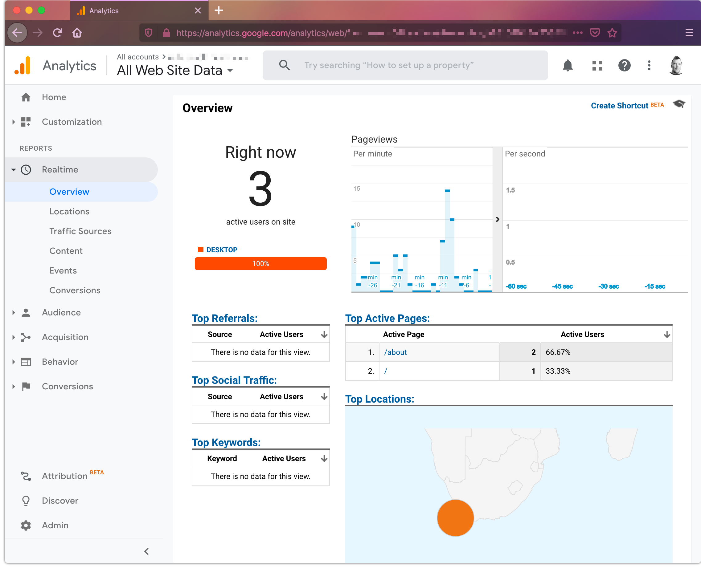
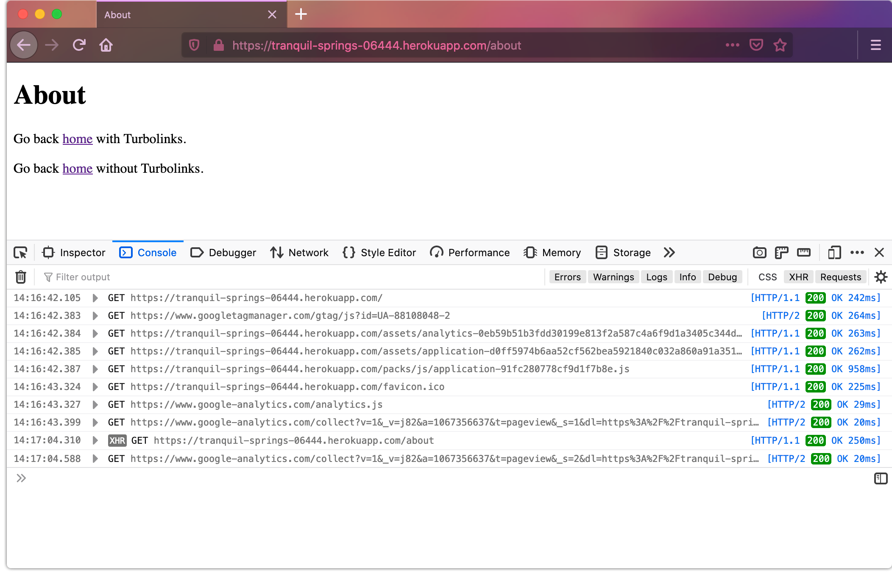

# Ruby on Rails 6 with Google Analytics, Content Security Protection, and Turbolinks

A demonstration of adding Google Analytics to a Ruby on Rails 6 app that is using Content Security Protection and Turbolinks.



## Key points

In `config/initializers/content_security_policy.rb` secure your site to only load scripts from known sources. Rails defaults to `:self, :https` which would allow any script from any site (bad guys use https too):
```ruby
...
policy.script_src :self, 
                  'https://www.googletagmanager.com', 
                  'https://www.google-analytics.com'
...
```

Use the `turbolinks:load` event to send page visits to Google Analytics. It will still capture the initial load that is not over XHR. Note the `cookie_flags` set to `secure;samesite=none`:
```javascript
...
const trackGoogleAnalytics = (event) => {
  window.gtag('config', 'GA_MEASUREMENT_ID', {
    'cookie_flags': 'max-age=7200;secure;samesite=none'
  })
}

document.addEventListener('turbolinks:load', trackGoogleAnalytics)
...
```

Our CSP does not allow for inline script blocks so you want to put your Google Analytics code in its own file and include it. Keep your Google Analytics Javascript out of Webpack compiled packs. e.g. `app/assets/javascript/analytics.js` and not `app/javascripts/analytics.js`:
```html
<script async src="https://www.googletagmanager.com/gtag/js?id=GA_MEASUREMENT_ID"></script>
<%= javascript_include_tag 'analytics', async: true %>
```

Don't forget to update `app/assets/config/manifest.js`:
```javascript
...
//= link analytics.js
..
```

You can view [a demo of this](https://tranquil-springs-06444.herokuapp.com/) and read [an article about it](https://medium.com/@paulmwatson/ruby-on-rails-6-with-google-analytics-turbolinks-and-a-content-security-policy-c4e078df8530):


